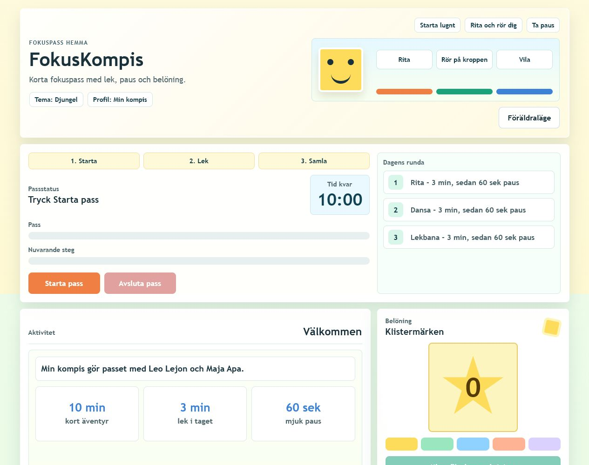
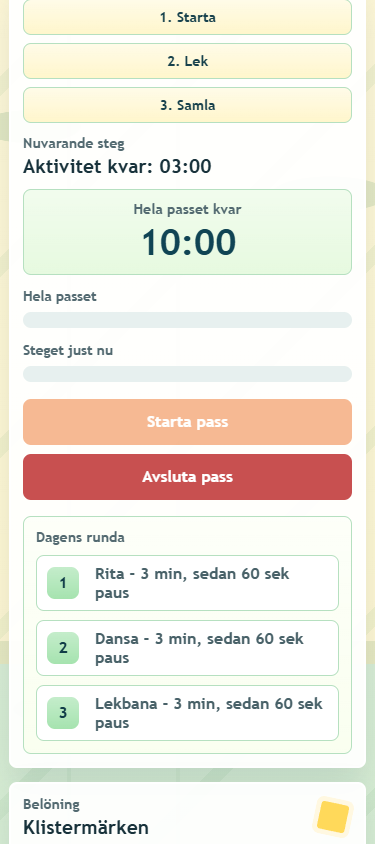

# FokusKompis

FokusKompis är en offline-webbapp för korta fokuspass med barn. Appen kombinerar ritning, rörelse, lugna pauser, belöningar, barnprofil och föräldrainställningar i ett enkelt gränssnitt som går att köra direkt i webbläsaren.

Jag byggde projektet som ett praktiskt portfolio-projekt under min utbildning till utvecklare inom AI och maskininlärning. Målet var att bygga något som går att använda hemma: en trygg, reklamfri app som min dotter kan använda tillsammans med en vuxen.

## GitHub-presentation

Kort repo-beskrivning:

> Offline focus app for children with drawing, movement breaks, local rewards, parent settings and a safe AI exercise-idea prototype.

Föreslagna topics:

`javascript`, `html`, `css`, `education`, `kids`, `offline-first`, `localstorage`, `canvas`, `web-audio`, `web-speech`, `ai-prototype`

Demo:

- Repo: https://github.com/Ibrahimorfali/fokuskompis
- Live-demo efter att GitHub Pages är aktiverat: https://ibrahimorfali.github.io/fokuskompis/
- Appen kan också köras genom att öppna `index.html` lokalt.

## Varför jag byggde den

Jag ville träna på att bygga en produkt där kod, användarflöde och trygghet hänger ihop. Målgruppen är små barn och vuxna som behöver ett lugnt verktyg för korta pass, vilket ställer krav på tydliga knappar, begränsade val, mobilanpassning, lokal lagring och ett gränssnitt som inte stressar.

Projektet passar också mitt AI/ML-spår: nästa steg är att undersöka hur AI kan hjälpa en vuxen att skapa nya barnvänliga övningar, utan konton, reklam eller onödig datainsamling.

## Skärmbilder

## Funktioner

- Fokuspass med timer, aktivitetssteg och paus.
- Barnprofil med namn som används i appens texter.
- Dagens mål med klistermärkesprogress.
- Tre aktivitetstyper: rita, dansa och lekbana.
- AI-idéverkstad som skapar trygga övningsförslag lokalt och lägger dem i aktivitetsbanken.
- Aktivitetsbank som visar övningar och hur ofta varje aktivitet klarats.
- Märken/achievements för första passet, klistermärken, alla aktiviteter och streak.
- Teman: djungel, hav och lekland.
- Talstöd och enkla ljudsignaler via Web Speech API och Web Audio API.
- Ritcanvas med pointer events.
- Belöningar, statistik, AI-förslag och streak sparas lokalt i webbläsaren.
- Föräldraläge med PIN, tidsinställningar, energinivå, rörelseläge, ljud och aktivitetstyper.
- Körs offline utan reklam, konton eller köp.

## Teknik

- HTML
- CSS
- JavaScript
- LocalStorage
- Canvas API
- Web Audio API
- Web Speech API
- Responsiv design

## AI-spår

Appen innehåller en lokal AI-idéverkstad i föräldraläget. Den är byggd som en säker produktprototyp: föräldern väljer fokusområde och aktivitetstyp, appen skapar barnvänliga övningsförslag och sparar dem lokalt.

I den här versionen är generatorn regelbaserad för att appen ska fungera helt offline. Tanken är att visa hur ett AI-flöde kan designas innan en riktig språkmodell kopplas in:

- inga barnkonton
- ingen extern datadelning
- korta instruktioner
- vuxen som godkänner innan övningar används
- tydlig koppling mellan behov, övning och aktivitetstyp

## Kör appen

Öppna `index.html` i en modern webbläsare.

Föräldraläge: PIN `1234`.

## Vad jag lärde mig

Det här projektet tränade mig i att tänka mer produktnära: inte bara att skriva kod, utan att bygga ett flöde som är begripligt för en riktig användare. Jag fick arbeta med state, timing, DOM-manipulation, lokal lagring, canvas, responsiv design och testning i webbläsaren.

Jag lärde mig också att små detaljer spelar stor roll: knappar måste vara tydliga, text måste få plats på mobil, pauser behöver kännas lugna och inställningar måste vara enkla för en vuxen att ändra.

## Nästa steg

- Aktivera GitHub Pages för en klickbar live-demo.
- Lägga till fler barnvänliga övningar.
- Göra en historikvy för tidigare pass.
- Bygga ett riktigt AI-läge där en språkmodell kan föreslå övningar utifrån tydliga säkerhetsregler och med vuxen granskning innan något sparas.
